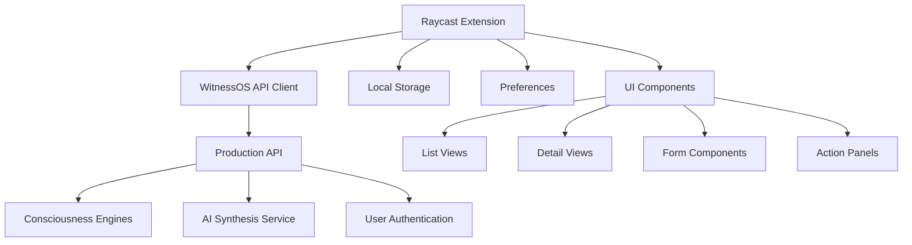

# WitnessOS Raycast Extension Development Guide

A comprehensive guide for building a WitnessOS Raycast extension that integrates consciousness engines, AI forecasting, and daily spiritual guidance directly into your workflow using Bleach-inspired naming conventions.

## 🗾 **Bleach-Inspired Engine Names**

### **Core Consciousness Engines (Zanpakuto-tier)**
- **Numerology** → **"Kazuhana" (数花)** - *Number Flower*
- **Human Design** → **"Tamashii no Sekkei" (魂の設計)** - *Soul Blueprint*
- **Tarot** → **"Mirai no Kagami" (未来の鏡)** - *Mirror of Futures*
- **I-Ching** → **"Kodai no Koe" (古代の声)** - *Ancient Voice*
- **Biorhythm** → **"Seimei no Nami" (生命の波)** - *Life Wave*
- **Enneagram** → **"Kyūkaku no Michi" (九角の道)** - *Nine-Angled Path*

### **Advanced Mystical Engines (Captain-tier)**
- **Gene Keys** → **"Iden no Kagi" (遺伝の鍵)** - *Genetic Keys*
- **Sacred Geometry** → **"Shinsei Kika" (神聖幾何)** - *Sacred Geometry*
- **Vimshottari** → **"Jikan no Shisha" (時間の使者)** - *Time Messenger*

### **AI Synthesis Engine (Soul King-tier)**
- **AI Consciousness Synthesis** → **"Ishiki no Ōja" (意識の王者)** - *Consciousness Sovereign*

## 🌟 Overview

The WitnessOS Raycast extension provides seamless access to consciousness technology through Raycast's native interface, enabling users to:

- **Access Consciousness Engines**: Connect to Bleach-inspired consciousness engines with mystical naming
- **Generate AI Forecasts**: Create daily/weekly forecasts using consciousness data with native AI integration
- **Dashboard Interface**: View engine results and forecasts in a clean, native UI
- **Model Selection**: Choose from multiple AI models via OpenRouter integration
- **AI Extensions**: Create natural language interactions for Quick AI, AI Chat, and AI Commands

## 🏗️ Architecture Overview



## 🎯 Core Functionality

### 1. Engine Integration
- **Direct API Access**: Connect to `https://api.witnessos.space`
- **10+ Consciousness Engines**: Numerology, Human Design, Tarot, I-Ching, etc.
- **Real-time Calculations**: Live engine processing with caching
- **Batch Processing**: Multiple engine calculations in parallel

### 2. AI Forecast Generation
- **Daily Guidance**: Biorhythm + I-Ching + Tarot synthesis
- **Weekly Forecasts**: Extended consciousness insights
- **Model Selection**: OpenRouter AI model dropdown interface
- **Personalized Context**: User profile-based recommendations

### 3. Dashboard Interface
- **Native UI**: Raycast's List, Detail, and Form components
- **Interactive Elements**: Dropdowns, action panels, copy functions
- **Visual Indicators**: Color-coded biorhythm status, icons
- **Navigation**: Seamless switching between views

## 📋 Latest Raycast API Capabilities (2024)

### **NEW: AI Integration Features**
- **useAI Hook**: Native AI integration with streaming support and creativity controls
- **AI Extensions**: Create natural language interactions for Quick AI, AI Chat, and AI Commands
- **AI Model Selection**: Support for multiple AI models (Claude, GPT-4, Llama, Gemini)
- **Streaming Responses**: Real-time AI response streaming with `stream: true` option
- **Creativity Control**: Adjustable creativity levels (0-2) for different use cases

### **Enhanced UI Components**
- **List**: Primary interface with improved search, filtering, and sections
- **Detail**: Markdown-based detailed views with enhanced action support
- **Form**: Advanced input collection with validation, drafts, and new form elements
- **Grid**: Visual layout for image-heavy content with size controls
- **Action Panel**: Context-sensitive actions with enhanced keyboard shortcuts
- **Menu Bar Extra**: Native menu bar integration for background operations

### **Advanced Form Elements**
- **TextField**: Single-line text input with enhanced validation
- **TextArea**: Multi-line text with markdown support and auto-resize
- **Dropdown**: Single selection with search, sections, and icons
- **TagPicker**: Multiple selection interface with custom icons
- **DatePicker**: Enhanced date/time selection with timezone support
- **Checkbox**: Boolean input with custom labels
- **FilePicker**: File/directory selection with filtering
- **Separator**: Visual form section dividers
- **Description**: Informational text elements

### **Enhanced Data & Storage**
- **LocalStorage**: Encrypted local database with improved performance
- **Preferences**: Extension configuration with dropdown, checkbox, and password types
- **Cache**: Built-in caching with TTL and invalidation patterns
- **OAuth**: Enhanced authentication flow support with multiple providers
- **Background Refresh**: Automatic data updates with configurable intervals

### **Modern API Integration**
- **Fetch API**: Standard HTTP requests with enhanced error handling
- **usePromise/useCachedPromise**: React hooks for async operations with caching
- **useFetch**: Dedicated hook for HTTP requests with built-in error handling
- **useStreamJSON**: Real-time JSON streaming support
- **Error Handling**: Enhanced toast notifications and user feedback
- **Rate Limiting**: Intelligent handling of API limits with retry logic

## 🤖 **NEW: AI Extension Features (2024)**

### Native AI Integration with useAI Hook
```typescript
import { Detail } from "@raycast/api";
import { useAI } from "@raycast/utils";

export default function SpiritualGuidance() {
  const { data, isLoading, revalidate } = useAI(
    "Channel the wisdom of Kazuhana (Numerology) to provide spiritual guidance for today",
    {
      creativity: 1.5, // Higher creativity for spiritual insights
      model: "anthropic/claude-3-sonnet",
      stream: true, // Real-time streaming responses
      onData: (response) => {
        // Handle streaming AI responses
        console.log("Spiritual wisdom flowing:", response);
      }
    }
  );

  return (
    <Detail
      isLoading={isLoading}
      markdown={data || "Channeling consciousness energy..."}
      actions={
        <ActionPanel>
          <Action title="Reactivate Bankai" onAction={revalidate} />
        </ActionPanel>
      }
    />
  );
}
```

### AI Extension Templates Available
- **AI Command Template**: Direct AI integration for consciousness queries
- **Show Detail Template**: Enhanced with AI streaming support
- **Submit Form Template**: AI-powered form processing
- **Show List and Detail**: AI-enhanced list views with dynamic content
- **Menu Bar Extra**: Background AI processing for daily guidance

### Enhanced Template Features
- **Blank Template**: Basic starting point with modern hooks
- **Show Grid Template**: Visual consciousness engine results
- **Show Typeahead Results**: AI-powered search suggestions
- **Tool with Confirmation**: Safety checks for consciousness operations
- **Extension Boilerplates**: Full-featured templates for team deployment

## 🔧 Technical Implementation

### Enhanced Project Structure (2024)
```
src/
├── api/
│   ├── witnessos-client.ts     # Main API client with AI integration
│   ├── ai-synthesis.ts         # AI consciousness synthesis
│   ├── types.ts                # TypeScript interfaces
│   └── config.ts               # API configuration
├── commands/
│   ├── daily-guidance.tsx      # Daily guidance with useAI hook
│   ├── engine-dashboard.tsx    # Bleach-inspired engine dashboard
│   ├── ai-forecast.tsx         # Native AI forecast generation
│   ├── consciousness-chat.tsx  # AI chat for spiritual guidance
│   └── bankai-mode.tsx         # Advanced AI synthesis command
├── ai-extensions/
│   ├── spiritual-advisor.tsx   # AI extension for Quick AI
│   ├── consciousness-chat.tsx  # AI Chat integration
│   └── daily-oracle.tsx        # AI Commands for daily guidance
├── components/
│   ├── ZanpakutoEngine.tsx     # Bleach-inspired engine display
│   ├── SpiritualIndicator.tsx  # Visual spiritual energy status
│   ├── AIStreamingCard.tsx     # Real-time AI response display
│   └── BankaiActivator.tsx     # Advanced AI synthesis trigger
├── hooks/
│   ├── useConsciousnessAI.ts   # Custom AI hook for spiritual queries
│   ├── useZanpakutoEngine.ts   # Engine-specific data fetching
│   └── useSpiritualGuidance.ts # Daily guidance with caching
└── utils/
    ├── bleach-naming.ts        # Bleach-inspired name mappings
    ├── ai-prompts.ts           # Spiritual AI prompt templates
    ├── formatting.ts           # Data formatting utilities
    └── validation.ts           # Input validation
```

### Enhanced API Client Architecture (2024)
```typescript
class WitnessOSAPI {
  private baseUrl: string = "https://api.witnessos.space";
  private token: string;
  private userProfile: UserProfile;
  private aiClient: AIClient; // New AI integration

  // Core Zanpakuto Engine Methods
  async activateKazuhana(input: NumerologyInput): Promise<EngineResult>
  async channelMiraiNoKagami(question: string): Promise<TarotResult>
  async consultKodaiNoKoe(intention: string): Promise<IChingResult>
  async analyzeTamashiiNoSekkei(birthData: BirthData): Promise<HumanDesignResult>
  async measureSeimeiNoNami(date: Date): Promise<BiorhythmResult>

  // AI Consciousness Synthesis (Ishiki no Ōja)
  async activateBankai(engines: string[], intention: string): Promise<AIResult>
  async streamSpiritualGuidance(prompt: string): AsyncGenerator<string>
  async synthesizeConsciousness(results: EngineResult[]): Promise<Synthesis>

  // Batch Processing with AI Enhancement
  async batchActivateZanpakuto(calculations: Calculation[]): Promise<BatchResult>

  // Native AI Integration (NEW)
  async queryConsciousnessAI(prompt: string, options?: AIOptions): Promise<AIResult>
  async streamAIGuidance(prompt: string, creativity: number): AsyncGenerator<string>

  // AI Extension Support
  async handleAICommand(command: string, context: any): Promise<AIResponse>
  async processNaturalLanguage(query: string): Promise<EngineAction>
}
```

### Authentication Flow
1. **User Registration**: Extension preferences for API token
2. **Token Storage**: Secure preference storage in Raycast
3. **Automatic Headers**: JWT token in all API requests
4. **Error Handling**: Token refresh and validation

### User Profile Management
- **Birth Data**: Date, time, location for calculations
- **Preferences**: Favorite engines, AI models, focus areas
- **History**: Previous readings and forecasts
- **Sync**: Cross-device preference synchronization

## 🎨 UI Component Examples

### Daily Guidance List View
```typescript
<List>
  <List.Section title="Today's Consciousness Guidance">
    <List.Item
      title="Daily Summary"
      subtitle={guidance.synthesis.summary}
      icon={{ source: Icon.Sun, tintColor: Color.Yellow }}
      actions={
        <ActionPanel>
          <Action title="View Details" onAction={() => setView("detailed")} />
          <Action.CopyToClipboard title="Copy Summary" content={summary} />
        </ActionPanel>
      }
    />
  </List.Section>
  
  <List.Section title="Biorhythm Status">
    {biorhythm.cycles.map(cycle => (
      <List.Item
        key={cycle.type}
        title={cycle.name}
        subtitle={`${cycle.percentage}% - ${cycle.phase}`}
        icon={getBiorhythmIcon(cycle.value)}
        accessories={[{ text: cycle.description }]}
      />
    ))}
  </List.Section>
</List>
```

### AI Model Selection Form with Bleach-Inspired Engines
```typescript
<Form
  actions={
    <ActionPanel>
      <Action.SubmitForm title="Activate Ishiki no Ōja" onSubmit={handleSubmit} />
    </ActionPanel>
  }
>
  <Form.Dropdown id="aiModel" title="AI Consciousness Model">
    <Form.Dropdown.Section title="Soul Reaper Models">
      <Form.Dropdown.Item value="anthropic/claude-3-sonnet" title="Claude 3 Sonnet" icon="⚔️" />
      <Form.Dropdown.Item value="openai/gpt-4" title="GPT-4" icon="🌟" />
      <Form.Dropdown.Item value="meta-llama/llama-2-70b" title="Llama 2 70B" icon="🦙" />
      <Form.Dropdown.Item value="google/gemini-pro" title="Gemini Pro" icon="💎" />
    </Form.Dropdown.Section>
  </Form.Dropdown>

  <Form.TagPicker id="engines" title="Zanpakuto Engines">
    <Form.TagPicker.Item value="numerology" title="Kazuhana (数花)" icon="🌸" />
    <Form.TagPicker.Item value="tarot" title="Mirai no Kagami (未来の鏡)" icon="🔮" />
    <Form.TagPicker.Item value="iching" title="Kodai no Koe (古代の声)" icon="☯️" />
    <Form.TagPicker.Item value="human_design" title="Tamashii no Sekkei (魂の設計)" icon="🎯" />
    <Form.TagPicker.Item value="biorhythm" title="Seimei no Nami (生命の波)" icon="〰️" />
    <Form.TagPicker.Item value="enneagram" title="Kyūkaku no Michi (九角の道)" icon="⭐" />
  </Form.TagPicker>

  <Form.Separator />

  <Form.TextArea
    id="intention"
    title="Spiritual Intention"
    placeholder="What guidance does your soul seek from the consciousness realm?"
    info="Channel your inner spiritual energy to receive personalized insights"
  />

  <Form.Description
    title="Bankai Mode"
    text="Activate the full power of your selected Zanpakuto engines with AI synthesis"
  />
</Form>
```

### Engine Dashboard Detail View
```typescript
<Detail
  markdown={generateMarkdownReport(engineResults)}
  actions={
    <ActionPanel>
      <Action title="Refresh Data" onAction={refreshEngines} />
      <Action.CopyToClipboard title="Copy Report" content={fullReport} />
      <Action title="Generate AI Forecast" onAction={generateForecast} />
      <Action title="Save to History" onAction={saveReading} />
    </ActionPanel>
  }
/>
```

## 🔐 Security & Authentication

### Token Management
- **Secure Storage**: Raycast's encrypted preference system
- **Token Validation**: Automatic validation on startup
- **Error Recovery**: Graceful handling of expired tokens
- **No Local Secrets**: All sensitive data stored securely

### Data Privacy
- **No Local Storage**: Sensitive data not cached locally
- **HTTPS Only**: All API communication encrypted
- **User Control**: Clear data management options
- **Minimal Data**: Only necessary information stored

## 🚀 Performance Optimization

### Caching Strategy
- **API Response Caching**: Intelligent caching for repeated calculations
- **User Profile Caching**: Local storage of user preferences
- **Image Caching**: Icon and visual element caching
- **Background Refresh**: Periodic cache updates

### Loading States
- **Progressive Loading**: Show data as it becomes available
- **Loading Indicators**: Native Raycast loading states
- **Error Boundaries**: Graceful error handling
- **Retry Logic**: Automatic retry for failed requests

## 📱 User Workflows

### Daily Guidance Workflow
1. **Launch Command**: "Daily Guidance" from Raycast
2. **Auto-Load**: Fetch biorhythm, I-Ching, and tarot data
3. **AI Synthesis**: Generate personalized recommendations
4. **Interactive View**: Browse insights with copy/share actions
5. **History Save**: Automatically save reading to history

### Engine Dashboard Workflow
1. **Select Engines**: Choose from available consciousness engines
2. **Batch Calculate**: Process multiple engines simultaneously
3. **Results Display**: View organized results with visual indicators
4. **AI Enhancement**: Optional AI interpretation of results
5. **Export Options**: Copy, save, or share results

### Forecast Generation Workflow
1. **Model Selection**: Choose AI model from dropdown
2. **Engine Selection**: Pick consciousness engines to include
3. **Intention Setting**: Provide context for personalized guidance
4. **Generate Forecast**: Process and synthesize results
5. **Interactive Report**: Browse detailed forecast with actions

## 🆕 **Latest Development Tools & Templates (2024)**

### Available Extension Templates
```bash
# Create extension with AI template
npm init raycast-extension -t ai

# Create with specific templates
npm init raycast-extension -t show-detail      # Enhanced with AI streaming
npm init raycast-extension -t submit-form      # AI-powered form processing
npm init raycast-extension -t show-grid        # Visual consciousness results
npm init raycast-extension -t menu-bar-extra   # Background AI processing
npm init raycast-extension -t tool-confirmation # Safety for consciousness ops

# Extension boilerplates for teams
npm init raycast-extension -t <template-name>
```

### Modern Development Features
- **Hot Reloading**: Instant updates during development
- **TypeScript Support**: Full type safety with enhanced API types
- **ESLint Integration**: Code quality with Raycast-specific rules
- **VS Code Extension**: Enhanced development experience
- **CLI Tools**: Improved `ray` command with new features
- **Extension Boilerplates**: Team-ready templates with customization guides

### New Raycast CLI Commands
```bash
# Enhanced development workflow
ray develop --hot-reload    # Development with instant updates
ray build --optimize        # Optimized production builds
ray publish --team          # Team/private extension publishing
ray lint --fix --ai         # AI-powered code fixes
ray test --coverage         # Extension testing with coverage
```

## 🛠️ Enhanced Development Setup

### Prerequisites (Updated 2024)
- **Raycast**: Latest version (1.59.0+) installed on macOS
- **Node.js**: Version 18 or higher (for AI features)
- **WitnessOS Account**: API token from production system
- **TypeScript**: Version 4.4+ for enhanced type safety
- **Raycast Pro**: Required for AI features and extensions

### Installation Steps
1. **Clone Template**: Use Raycast extension template
2. **Install Dependencies**: `npm install @raycast/api`
3. **Configure Manifest**: Set up package.json with commands
4. **Add Preferences**: Configure API token and user profile
5. **Implement Commands**: Build individual command components

### Development Commands
```bash
# Development mode with hot reload
npm run dev

# Build for production
npm run build

# Lint and fix code
npm run lint --fix

# Publish to Raycast Store
npm run publish
```

## 📊 Error Handling & Debugging

### Common Error Scenarios
- **API Token Invalid**: Clear error message with setup instructions
- **Network Failures**: Retry logic with user feedback
- **Rate Limiting**: Graceful degradation with timing info
- **Invalid Input**: Form validation with helpful messages

### Debug Tools
- **Console Logging**: Structured logging for development
- **Error Boundaries**: React error boundaries for UI crashes
- **API Response Logging**: Detailed API interaction logs
- **Performance Monitoring**: Request timing and caching metrics

## 🔄 Background Processes

### Automatic Updates
- **Profile Sync**: Keep user profile synchronized
- **Cache Refresh**: Update cached data periodically
- **Token Refresh**: Automatic token renewal
- **Notification System**: Alert users to important updates

### Offline Capabilities
- **Cached Data**: Show last known results when offline
- **Queue Requests**: Queue API calls for when online
- **Graceful Degradation**: Reduced functionality when disconnected
- **Sync on Reconnect**: Automatic sync when connection restored

## 📈 Analytics & Insights

### Usage Tracking
- **Command Usage**: Track most popular commands
- **Engine Preferences**: Understand user engine preferences
- **Error Rates**: Monitor and improve error handling
- **Performance Metrics**: Optimize based on usage patterns

### User Feedback
- **Rating System**: Built-in feedback collection
- **Feature Requests**: Channel for user suggestions
- **Bug Reports**: Streamlined bug reporting process
- **Community Integration**: Connect with WitnessOS community

## 💻 Implementation Examples

### Complete API Client Implementation

```typescript
// src/api/witnessos-client.ts
import { getPreferenceValues, showToast, Toast } from "@raycast/api";

interface Preferences {
  apiToken: string;
  apiBaseUrl: string;
  fullName: string;
  birthDate: string;
  birthTime?: string;
  birthLocation?: string;
}

interface APIResponse<T = any> {
  success: boolean;
  data?: T;
  error?: string;
  message?: string;
  timestamp: string;
  requestId?: string;
}

export class WitnessOSAPI {
  private baseUrl: string;
  private token: string;
  private userProfile: UserProfile;

  constructor() {
    const preferences = getPreferenceValues<Preferences>();
    this.baseUrl = preferences.apiBaseUrl || "https://api.witnessos.space";
    this.token = preferences.apiToken;
    this.userProfile = {
      fullName: preferences.fullName,
      birthDate: preferences.birthDate,
      birthTime: preferences.birthTime,
      birthLocation: preferences.birthLocation,
    };
  }

  private async makeRequest<T>(
    endpoint: string,
    options: RequestInit = {}
  ): Promise<APIResponse<T>> {
    const url = `${this.baseUrl}${endpoint}`;
    const headers = {
      "Content-Type": "application/json",
      "Authorization": `Bearer ${this.token}`,
      ...options.headers,
    };

    try {
      const response = await fetch(url, { ...options, headers });
      const data = await response.json();

      if (!response.ok) {
        throw new Error(data.message || `HTTP ${response.status}`);
      }

      return data;
    } catch (error) {
      await showToast({
        style: Toast.Style.Failure,
        title: "API Request Failed",
        message: error instanceof Error ? error.message : "Unknown error",
      });
      throw error;
    }
  }

  // Engine Methods
  async calculateNumerology(): Promise<APIResponse<NumerologyResult>> {
    return this.makeRequest("/engines/numerology/calculate", {
      method: "POST",
      body: JSON.stringify({
        input: {
          birth_date: this.userProfile.birthDate,
          full_name: this.userProfile.fullName,
        },
        options: { useCache: true },
      }),
    });
  }

  async getTarotReading(question: string): Promise<APIResponse<TarotResult>> {
    return this.makeRequest("/engines/tarot/calculate", {
      method: "POST",
      body: JSON.stringify({
        input: {
          question,
          spread_type: "three_card",
          deck: "rider_waite",
        },
      }),
    });
  }

  async calculateBiorhythm(): Promise<APIResponse<BiorhythmResult>> {
    return this.makeRequest("/engines/biorhythm/calculate", {
      method: "POST",
      body: JSON.stringify({
        input: {
          birth_date: this.userProfile.birthDate,
          target_date: new Date().toISOString().split('T')[0],
          days_ahead: 7,
        },
        options: { useCache: true },
      }),
    });
  }

  // Workflow Methods
  async getDailyGuidance(): Promise<APIResponse<WorkflowResult>> {
    return this.makeRequest("/workflows/daily", {
      method: "POST",
      body: JSON.stringify({
        userProfile: this.userProfile,
        intention: "guidance for today and optimal energy management",
      }),
    });
  }

  // AI Enhancement
  async getAIEnhancedReading(
    engine: string,
    model: string,
    focusArea?: string
  ): Promise<APIResponse> {
    return this.makeRequest(`/engines/${engine}/ai-enhanced`, {
      method: "POST",
      body: JSON.stringify({
        input: this.getEngineInput(engine),
        aiConfig: {
          model,
          temperature: 0.7,
          focusArea: focusArea || "spiritual development",
        },
      }),
    });
  }

  private getEngineInput(engine: string): any {
    switch (engine) {
      case "numerology":
        return {
          birth_date: this.userProfile.birthDate,
          full_name: this.userProfile.fullName,
        };
      case "human_design":
        return {
          birth_date: this.userProfile.birthDate,
          birth_time: this.userProfile.birthTime,
          birth_location: this.userProfile.birthLocation,
        };
      default:
        return {};
    }
  }
}
```

### Daily Guidance Command Implementation

```typescript
// src/commands/daily-guidance.tsx
import { ActionPanel, Action, List, showToast, Toast, Detail } from "@raycast/api";
import { useState, useEffect } from "react";
import { WitnessOSAPI } from "../api/witnessos-client";

interface GuidanceData {
  workflow_type: string;
  engines_used: string[];
  results: {
    biorhythm?: BiorhythmResult;
    iching?: IChingResult;
    tarot?: TarotResult;
  };
  synthesis: {
    summary: string;
    detailed_interpretation: string;
    key_insights: string[];
    recommendations: string[];
  };
}

export default function DailyGuidance() {
  const [guidance, setGuidance] = useState<GuidanceData | null>(null);
  const [loading, setLoading] = useState(true);
  const [error, setError] = useState<string | null>(null);
  const [selectedView, setSelectedView] = useState<string | null>(null);

  const api = new WitnessOSAPI();

  useEffect(() => {
    fetchGuidance();
  }, []);

  async function fetchGuidance() {
    try {
      setLoading(true);
      setError(null);

      const result = await api.getDailyGuidance();

      if (result.success && result.data) {
        setGuidance(result.data);
        await showToast({
          style: Toast.Style.Success,
          title: "Daily guidance loaded",
          message: "Your consciousness insights are ready",
        });
      } else {
        throw new Error(result.message || "Failed to fetch guidance");
      }
    } catch (error) {
      const errorMessage = error instanceof Error ? error.message : "Unknown error";
      setError(errorMessage);
    } finally {
      setLoading(false);
    }
  }

  if (loading) {
    return <List isLoading={true} />;
  }

  if (error) {
    return (
      <List>
        <List.Item
          title="Error Loading Guidance"
          subtitle={error}
          icon="⚠️"
          actions={
            <ActionPanel>
              <Action title="Retry" onAction={fetchGuidance} />
            </ActionPanel>
          }
        />
      </List>
    );
  }

  if (!guidance) {
    return (
      <List>
        <List.Item
          title="No Guidance Available"
          subtitle="Unable to load consciousness insights"
          icon="❓"
        />
      </List>
    );
  }

  if (selectedView === "detailed") {
    return (
      <Detail
        markdown={generateDetailedMarkdown(guidance)}
        actions={
          <ActionPanel>
            <Action
              title="Back to Overview"
              onAction={() => setSelectedView(null)}
            />
            <Action.CopyToClipboard
              title="Copy Full Guidance"
              content={generateDetailedMarkdown(guidance)}
            />
          </ActionPanel>
        }
      />
    );
  }

  return (
    <List>
      <List.Section title="Today's Consciousness Guidance">
        <List.Item
          title="Daily Summary"
          subtitle={guidance.synthesis.summary}
          icon="☀️"
          actions={
            <ActionPanel>
              <Action
                title="View Detailed Guidance"
                onAction={() => setSelectedView("detailed")}
              />
              <Action.CopyToClipboard
                title="Copy Summary"
                content={guidance.synthesis.summary}
              />
              <Action title="Refresh" onAction={fetchGuidance} />
            </ActionPanel>
          }
        />
      </List.Section>

      {guidance.results.biorhythm && (
        <List.Section title="Biorhythm Status">
          <List.Item
            title="Physical Energy"
            subtitle={`${formatPercentage(guidance.results.biorhythm.physical.value)} - ${guidance.results.biorhythm.physical.phase}`}
            icon={getBiorhythmIcon(guidance.results.biorhythm.physical.value)}
            accessories={[{ text: guidance.results.biorhythm.physical.description }]}
          />
          <List.Item
            title="Emotional State"
            subtitle={`${formatPercentage(guidance.results.biorhythm.emotional.value)} - ${guidance.results.biorhythm.emotional.phase}`}
            icon={getBiorhythmIcon(guidance.results.biorhythm.emotional.value)}
            accessories={[{ text: guidance.results.biorhythm.emotional.description }]}
          />
          <List.Item
            title="Intellectual Clarity"
            subtitle={`${formatPercentage(guidance.results.biorhythm.intellectual.value)} - ${guidance.results.biorhythm.intellectual.phase}`}
            icon={getBiorhythmIcon(guidance.results.biorhythm.intellectual.value)}
            accessories={[{ text: guidance.results.biorhythm.intellectual.description }]}
          />
        </List.Section>
      )}

      <List.Section title="Key Insights">
        {guidance.synthesis.key_insights.map((insight, index) => (
          <List.Item
            key={index}
            title={`Insight ${index + 1}`}
            subtitle={insight}
            icon="💡"
            actions={
              <ActionPanel>
                <Action.CopyToClipboard title="Copy Insight" content={insight} />
              </ActionPanel>
            }
          />
        ))}
      </List.Section>

      <List.Section title="Recommendations">
        {guidance.synthesis.recommendations.map((recommendation, index) => (
          <List.Item
            key={index}
            title={`Action ${index + 1}`}
            subtitle={recommendation}
            icon="✅"
            actions={
              <ActionPanel>
                <Action.CopyToClipboard title="Copy Recommendation" content={recommendation} />
              </ActionPanel>
            }
          />
        ))}
      </List.Section>
    </List>
  );
}

// Utility Functions
function getBiorhythmIcon(value: number) {
  if (value > 0.5) return { source: "↑", tintColor: "#00FF00" };
  if (value > 0) return { source: "−", tintColor: "#FFFF00" };
  return { source: "↓", tintColor: "#FF0000" };
}

function formatPercentage(value: number): string {
  return `${(value * 100).toFixed(1)}%`;
}

function generateDetailedMarkdown(guidance: GuidanceData): string {
  return `
# Daily Consciousness Guidance

## Summary
${guidance.synthesis.summary}

## Detailed Interpretation
${guidance.synthesis.detailed_interpretation}

## Key Insights
${guidance.synthesis.key_insights.map(insight => `• ${insight}`).join('\n')}

## Recommendations
${guidance.synthesis.recommendations.map(rec => `• ${rec}`).join('\n')}

---

*Generated by WitnessOS Consciousness API*
  `;
}
```

### AI Model Selection Form

```typescript
// src/commands/forecast-generator.tsx
import { ActionPanel, Action, Form, showToast, Toast, useNavigation } from "@raycast/api";
import { useState } from "react";
import { WitnessOSAPI } from "../api/witnessos-client";

interface ForecastFormValues {
  aiModel: string;
  engines: string[];
  intention: string;
  forecastType: string;
}

const AI_MODELS = [
  { id: "anthropic/claude-3-sonnet", name: "Claude 3 Sonnet", provider: "Anthropic" },
  { id: "openai/gpt-4", name: "GPT-4", provider: "OpenAI" },
  { id: "meta-llama/llama-2-70b", name: "Llama 2 70B", provider: "Meta" },
  { id: "google/gemini-pro", name: "Gemini Pro", provider: "Google" },
];

const CONSCIOUSNESS_ENGINES = [
  { id: "numerology", name: "Numerology", icon: "🔢" },
  { id: "tarot", name: "Tarot", icon: "🃏" },
  { id: "iching", name: "I-Ching", icon: "☯️" },
  { id: "human_design", name: "Human Design", icon: "🎯" },
  { id: "biorhythm", name: "Biorhythm", icon: "📊" },
  { id: "enneagram", name: "Enneagram", icon: "⭐" },
];

export default function ForecastGenerator() {
  const [isLoading, setIsLoading] = useState(false);
  const { push } = useNavigation();
  const api = new WitnessOSAPI();

  async function handleSubmit(values: ForecastFormValues) {
    setIsLoading(true);

    try {
      await showToast({
        style: Toast.Style.Animated,
        title: "Generating forecast...",
        message: "Processing consciousness data with AI",
      });

      // Generate forecast using selected parameters
      const forecast = await generateCustomForecast(values);

      await showToast({
        style: Toast.Style.Success,
        title: "Forecast generated!",
        message: "Your personalized guidance is ready",
      });

      // Navigate to results view
      push(<ForecastResults forecast={forecast} />);

    } catch (error) {
      await showToast({
        style: Toast.Style.Failure,
        title: "Generation failed",
        message: error instanceof Error ? error.message : "Unknown error",
      });
    } finally {
      setIsLoading(false);
    }
  }

  async function generateCustomForecast(values: ForecastFormValues) {
    // Batch calculate selected engines
    const calculations = values.engines.map(engine => ({
      engine,
      input: api.getEngineInput(engine),
    }));

    const batchResult = await api.batchCalculate(calculations);

    // Generate AI synthesis with selected model
    const synthesis = await api.synthesizeResults(
      batchResult.data.results,
      {
        model: values.aiModel,
        intention: values.intention,
        forecastType: values.forecastType,
      }
    );

    return {
      engines: values.engines,
      model: values.aiModel,
      results: batchResult.data.results,
      synthesis: synthesis.data,
      timestamp: new Date().toISOString(),
    };
  }

  return (
    <Form
      isLoading={isLoading}
      actions={
        <ActionPanel>
          <Action.SubmitForm
            title="Generate Forecast"
            onSubmit={handleSubmit}
            icon="🔮"
          />
        </ActionPanel>
      }
    >
      <Form.Dropdown id="forecastType" title="Forecast Type" defaultValue="daily">
        <Form.Dropdown.Item value="daily" title="Daily Guidance" icon="☀️" />
        <Form.Dropdown.Item value="weekly" title="Weekly Overview" icon="📅" />
        <Form.Dropdown.Item value="monthly" title="Monthly Insights" icon="🌙" />
      </Form.Dropdown>

      <Form.Dropdown id="aiModel" title="AI Model" defaultValue="anthropic/claude-3-sonnet">
        {AI_MODELS.map(model => (
          <Form.Dropdown.Item
            key={model.id}
            value={model.id}
            title={model.name}
            icon="🤖"
            keywords={[model.provider]}
          />
        ))}
      </Form.Dropdown>

      <Form.TagPicker
        id="engines"
        title="Consciousness Engines"
        defaultValue={["numerology", "biorhythm", "tarot"]}
      >
        {CONSCIOUSNESS_ENGINES.map(engine => (
          <Form.TagPicker.Item
            key={engine.id}
            value={engine.id}
            title={engine.name}
            icon={engine.icon}
          />
        ))}
      </Form.TagPicker>

      <Form.TextArea
        id="intention"
        title="Intention & Context"
        placeholder="What specific guidance are you seeking? Include any current challenges, goals, or areas of focus..."
        info="Provide context to help the AI generate more personalized and relevant insights"
      />

      <Form.Separator />

      <Form.Description
        title="AI Enhancement"
        text="Your selected consciousness engines will be processed and synthesized using the chosen AI model to provide personalized insights and actionable guidance."
      />
    </Form>
  );
}
```

### Engine Dashboard Implementation

```typescript
// src/commands/engine-dashboard.tsx
import { ActionPanel, Action, List, showToast, Toast, Icon, Color } from "@raycast/api";
import { useState, useEffect } from "react";
import { WitnessOSAPI } from "../api/witnessos-client";

interface EngineStatus {
  name: string;
  available: boolean;
  lastCalculated?: string;
  result?: any;
  error?: string;
}

interface DashboardState {
  engines: EngineStatus[];
  loading: boolean;
  selectedEngines: string[];
}

export default function EngineDashboard() {
  const [state, setState] = useState<DashboardState>({
    engines: [],
    loading: true,
    selectedEngines: [],
  });

  const api = new WitnessOSAPI();

  useEffect(() => {
    loadEngineStatus();
  }, []);

  async function loadEngineStatus() {
    try {
      setState(prev => ({ ...prev, loading: true }));

      // Get available engines
      const enginesResponse = await api.listEngines();

      if (enginesResponse.success) {
        const engines = enginesResponse.data.engines.map((engine: any) => ({
          name: engine.name,
          available: engine.available,
          metadata: engine.metadata,
        }));

        setState(prev => ({
          ...prev,
          engines,
          loading: false,
        }));
      }
    } catch (error) {
      await showToast({
        style: Toast.Style.Failure,
        title: "Failed to load engines",
        message: error instanceof Error ? error.message : "Unknown error",
      });
      setState(prev => ({ ...prev, loading: false }));
    }
  }

  async function calculateEngine(engineName: string) {
    try {
      await showToast({
        style: Toast.Style.Animated,
        title: `Calculating ${engineName}...`,
        message: "Processing consciousness data",
      });

      let result;
      switch (engineName) {
        case "numerology":
          result = await api.calculateNumerology();
          break;
        case "biorhythm":
          result = await api.calculateBiorhythm();
          break;
        case "tarot":
          result = await api.getTarotReading("What guidance do I need today?");
          break;
        default:
          throw new Error(`Engine ${engineName} not implemented`);
      }

      if (result.success) {
        // Update engine status with result
        setState(prev => ({
          ...prev,
          engines: prev.engines.map(engine =>
            engine.name === engineName
              ? {
                  ...engine,
                  result: result.data,
                  lastCalculated: new Date().toISOString(),
                  error: undefined,
                }
              : engine
          ),
        }));

        await showToast({
          style: Toast.Style.Success,
          title: `${engineName} calculated!`,
          message: "Results are ready to view",
        });
      }
    } catch (error) {
      setState(prev => ({
        ...prev,
        engines: prev.engines.map(engine =>
          engine.name === engineName
            ? {
                ...engine,
                error: error instanceof Error ? error.message : "Calculation failed",
              }
            : engine
        ),
      }));

      await showToast({
        style: Toast.Style.Failure,
        title: `${engineName} calculation failed`,
        message: error instanceof Error ? error.message : "Unknown error",
      });
    }
  }

  async function batchCalculateSelected() {
    if (state.selectedEngines.length === 0) {
      await showToast({
        style: Toast.Style.Failure,
        title: "No engines selected",
        message: "Please select engines to calculate",
      });
      return;
    }

    try {
      await showToast({
        style: Toast.Style.Animated,
        title: "Batch calculating...",
        message: `Processing ${state.selectedEngines.length} engines`,
      });

      const calculations = state.selectedEngines.map(engine => ({
        engine,
        input: api.getEngineInput(engine),
      }));

      const batchResult = await api.batchCalculate(calculations);

      if (batchResult.success) {
        // Update all calculated engines
        setState(prev => ({
          ...prev,
          engines: prev.engines.map(engine => {
            const result = batchResult.data.results.find(
              (r: any) => r.engine === engine.name
            );
            return result
              ? {
                  ...engine,
                  result: result.data,
                  lastCalculated: new Date().toISOString(),
                  error: undefined,
                }
              : engine;
          }),
        }));

        await showToast({
          style: Toast.Style.Success,
          title: "Batch calculation complete!",
          message: `${state.selectedEngines.length} engines processed`,
        });
      }
    } catch (error) {
      await showToast({
        style: Toast.Style.Failure,
        title: "Batch calculation failed",
        message: error instanceof Error ? error.message : "Unknown error",
      });
    }
  }

  function getEngineIcon(engineName: string): { source: string; tintColor?: string } {
    const iconMap: Record<string, { source: string; tintColor?: string }> = {
      numerology: { source: Icon.Calculator, tintColor: Color.Blue },
      tarot: { source: Icon.Stars, tintColor: Color.Purple },
      biorhythm: { source: Icon.BarChart, tintColor: Color.Green },
      iching: { source: Icon.Book, tintColor: Color.Orange },
      human_design: { source: Icon.Target, tintColor: Color.Red },
      enneagram: { source: Icon.Star, tintColor: Color.Yellow },
    };
    return iconMap[engineName] || { source: Icon.Gear };
  }

  function getEngineStatus(engine: EngineStatus): { icon: any; subtitle: string } {
    if (engine.error) {
      return {
        icon: { source: Icon.ExclamationMark, tintColor: Color.Red },
        subtitle: `Error: ${engine.error}`,
      };
    }

    if (engine.result) {
      return {
        icon: { source: Icon.CheckCircle, tintColor: Color.Green },
        subtitle: `Last calculated: ${formatDate(engine.lastCalculated!)}`,
      };
    }

    if (!engine.available) {
      return {
        icon: { source: Icon.Minus, tintColor: Color.SecondaryText },
        subtitle: "Engine unavailable",
      };
    }

    return {
      icon: { source: Icon.Circle, tintColor: Color.SecondaryText },
      subtitle: "Ready to calculate",
    };
  }

  function formatDate(isoString: string): string {
    return new Date(isoString).toLocaleString();
  }

  return (
    <List
      isLoading={state.loading}
      searchBarAccessory={
        <List.Dropdown
          tooltip="Filter Engines"
          onChange={(value) => {
            // Filter logic here
          }}
        >
          <List.Dropdown.Item title="All Engines" value="all" />
          <List.Dropdown.Item title="Available Only" value="available" />
          <List.Dropdown.Item title="Calculated" value="calculated" />
        </List.Dropdown>
      }
    >
      <List.Section title="Consciousness Engines">
        {state.engines.map((engine) => {
          const status = getEngineStatus(engine);
          const engineIcon = getEngineIcon(engine.name);

          return (
            <List.Item
              key={engine.name}
              title={engine.metadata?.name || engine.name}
              subtitle={status.subtitle}
              icon={engineIcon}
              accessories={[
                status.icon,
                ...(engine.result ? [{ text: "✓" }] : []),
              ]}
              actions={
                <ActionPanel>
                  <Action
                    title="Calculate Engine"
                    onAction={() => calculateEngine(engine.name)}
                    icon={Icon.Play}
                  />
                  {engine.result && (
                    <Action
                      title="View Results"
                      onAction={() => {
                        // Navigate to detailed results view
                      }}
                      icon={Icon.Eye}
                    />
                  )}
                  <Action
                    title="Add to Batch"
                    onAction={() => {
                      setState(prev => ({
                        ...prev,
                        selectedEngines: [...prev.selectedEngines, engine.name],
                      }));
                    }}
                    icon={Icon.Plus}
                  />
                </ActionPanel>
              }
            />
          );
        })}
      </List.Section>

      {state.selectedEngines.length > 0 && (
        <List.Section title="Batch Operations">
          <List.Item
            title="Calculate Selected Engines"
            subtitle={`${state.selectedEngines.length} engines selected`}
            icon={Icon.Bolt}
            actions={
              <ActionPanel>
                <Action
                  title="Run Batch Calculation"
                  onAction={batchCalculateSelected}
                  icon={Icon.Play}
                />
                <Action
                  title="Clear Selection"
                  onAction={() => {
                    setState(prev => ({ ...prev, selectedEngines: [] }));
                  }}
                  icon={Icon.Trash}
                />
              </ActionPanel>
            }
          />
        </List.Section>
      )}
    </List>
  );
}
```

## 📦 Package Configuration

### Enhanced package.json Manifest (2024)

```json
{
  "$schema": "https://www.raycast.com/schemas/extension.json",
  "name": "witnessos-consciousness",
  "title": "WitnessOS: Bleach-Inspired Consciousness",
  "description": "Access Zanpakuto consciousness engines and AI-powered spiritual guidance with Bleach anime aesthetics",
  "icon": "⚔️",
  "author": "witnessos",
  "categories": ["Productivity", "AI", "Fun", "Developer Tools"],
  "license": "MIT",
  "version": "2.0.0",
  "commands": [
    {
      "name": "daily-guidance",
      "title": "Daily Spiritual Guidance",
      "description": "Channel Ishiki no Ōja for personalized consciousness insights",
      "mode": "view",
      "keywords": ["daily", "guidance", "consciousness", "spiritual", "bankai"]
    },
    {
      "name": "ai-consciousness-chat",
      "title": "Consciousness AI Chat",
      "description": "Natural language spiritual guidance with streaming AI responses",
      "mode": "view",
      "keywords": ["ai", "chat", "consciousness", "spiritual", "streaming"]
    },
    {
      "name": "zanpakuto-dashboard",
      "title": "Zanpakuto Engine Dashboard",
      "description": "Activate and monitor Bleach-inspired consciousness engines",
      "mode": "view",
      "keywords": ["zanpakuto", "engines", "dashboard", "bleach", "consciousness"]
    },
    {
      "name": "bankai-forecast",
      "title": "Bankai AI Forecast",
      "description": "Unleash full AI power for consciousness forecasting",
      "mode": "view",
      "keywords": ["bankai", "ai", "forecast", "consciousness", "synthesis"]
    },
    {
      "name": "kazuhana-numerology",
      "title": "Kazuhana (数花) - Numerology",
      "description": "Activate the Number Flower Zanpakuto for numerological insights",
      "mode": "view",
      "keywords": ["kazuhana", "numerology", "numbers", "bleach"]
    },
    {
      "name": "numerology-reading",
      "title": "Numerology Reading",
      "description": "Calculate your complete numerology profile and life path",
      "mode": "view",
      "keywords": ["numerology", "life path", "numbers"]
    },
    {
      "name": "tarot-reading",
      "title": "Tarot Reading",
      "description": "Get personalized tarot guidance for your questions",
      "mode": "view",
      "keywords": ["tarot", "cards", "divination", "guidance"]
    },
    {
      "name": "seimei-no-nami",
      "title": "Seimei no Nami (生命の波) - Biorhythm",
      "description": "Channel the Life Wave Zanpakuto for energy cycle monitoring",
      "mode": "view",
      "keywords": ["seimei", "biorhythm", "life wave", "energy", "cycles"]
    }
  ],
  "ai": {
    "enabled": true,
    "extensions": [
      {
        "name": "spiritual-advisor",
        "title": "WitnessOS Spiritual Advisor",
        "description": "AI-powered consciousness guidance using Bleach-inspired engines",
        "instructions": "You are a spiritual advisor with access to consciousness engines inspired by Bleach anime. Use Zanpakuto terminology and provide mystical guidance.",
        "creativity": "medium",
        "model": "anthropic/claude-3-sonnet"
      },
      {
        "name": "consciousness-oracle",
        "title": "Consciousness Oracle",
        "description": "Daily spiritual insights through AI synthesis",
        "instructions": "Channel the power of Ishiki no Ōja to provide daily consciousness guidance using numerology, tarot, and biorhythm data.",
        "creativity": "high",
        "model": "openai/gpt-4"
      }
    ]
  },
  "preferences": [
    {
      "name": "apiToken",
      "type": "password",
      "required": true,
      "title": "WitnessOS API Token",
      "description": "Your JWT token from WitnessOS authentication",
      "placeholder": "Enter your API token"
    },
    {
      "name": "apiBaseUrl",
      "type": "textfield",
      "required": false,
      "title": "API Base URL",
      "description": "WitnessOS API endpoint (leave empty for production)",
      "default": "https://api.witnessos.space",
      "placeholder": "https://api.witnessos.space"
    },
    {
      "name": "fullName",
      "type": "textfield",
      "required": true,
      "title": "Full Name",
      "description": "Your complete name for consciousness calculations",
      "placeholder": "John Doe"
    },
    {
      "name": "birthDate",
      "type": "textfield",
      "required": true,
      "title": "Birth Date",
      "description": "Your birth date in YYYY-MM-DD format",
      "placeholder": "1990-01-15"
    },
    {
      "name": "birthTime",
      "type": "textfield",
      "required": false,
      "title": "Birth Time",
      "description": "Your birth time in HH:MM format (for Human Design)",
      "placeholder": "14:30"
    },
    {
      "name": "birthLocation",
      "type": "textfield",
      "required": false,
      "title": "Birth Location",
      "description": "Your birth location (for Human Design)",
      "placeholder": "New York, NY, USA"
    },
    {
      "name": "defaultAIModel",
      "type": "dropdown",
      "required": false,
      "title": "Default AI Model",
      "description": "Preferred AI model for forecasts and synthesis",
      "default": "anthropic/claude-3-sonnet",
      "data": [
        { title: "Claude 3 Sonnet", value: "anthropic/claude-3-sonnet" },
        { title: "GPT-4", value: "openai/gpt-4" },
        { title: "Llama 2 70B", value: "meta-llama/llama-2-70b" },
        { title: "Gemini Pro", value: "google/gemini-pro" }
      ]
    },
    {
      "name": "enableNotifications",
      "type": "checkbox",
      "required": false,
      "title": "Enable Notifications",
      "description": "Receive daily guidance notifications",
      "default": true,
      "label": "Send daily consciousness reminders"
    }
  ],
  "dependencies": {
    "@raycast/api": "^1.59.0",
    "@raycast/utils": "^1.10.0"
  },
  "devDependencies": {
    "@types/node": "20.10.0",
    "@types/react": "18.2.45",
    "@typescript-eslint/eslint-plugin": "^6.0.0",
    "@typescript-eslint/parser": "^6.0.0",
    "eslint": "^8.55.0",
    "eslint-config-prettier": "^9.1.0",
    "prettier": "^3.1.1",
    "typescript": "^5.3.3"
  },
  "scripts": {
    "build": "ray build -e dist",
    "dev": "ray develop",
    "fix-lint": "ray lint --fix",
    "lint": "ray lint",
    "publish": "ray publish"
  }
}
```

### TypeScript Configuration

```json
// tsconfig.json
{
  "compilerOptions": {
    "target": "ES2020",
    "lib": ["ES2020"],
    "module": "commonjs",
    "moduleResolution": "node",
    "strict": true,
    "esModuleInterop": true,
    "skipLibCheck": true,
    "forceConsistentCasingInFileNames": true,
    "resolveJsonModule": true,
    "jsx": "react-jsx",
    "declaration": true,
    "outDir": "./dist",
    "baseUrl": ".",
    "paths": {
      "@/*": ["./src/*"]
    }
  },
  "include": ["src/**/*"],
  "exclude": ["node_modules", "dist"]
}
```

## 🚀 Deployment Guide

### Development Setup

1. **Install Raycast CLI**
   ```bash
   npm install -g @raycast/cli
   ```

2. **Create Extension**
   ```bash
   ray create witnessos-consciousness
   cd witnessos-consciousness
   ```

3. **Install Dependencies**
   ```bash
   npm install @raycast/api @raycast/utils
   npm install -D typescript @types/node @types/react
   ```

4. **Configure Extension**
   - Copy the package.json configuration above
   - Set up your API token in Raycast preferences
   - Configure user profile information

### Development Workflow

```bash
# Start development mode with hot reload
npm run dev

# Build extension for testing
npm run build

# Lint and fix code issues
npm run lint --fix

# Test extension locally
ray develop
```

### Testing Checklist

- [ ] **API Authentication**: Verify token validation and error handling
- [ ] **Engine Calculations**: Test all consciousness engines individually
- [ ] **Batch Processing**: Verify multiple engine calculations work
- [ ] **AI Integration**: Test forecast generation with different models
- [ ] **Error Handling**: Verify graceful error handling and user feedback
- [ ] **Performance**: Check loading times and caching behavior
- [ ] **UI Responsiveness**: Test all UI components and interactions
- [ ] **Data Persistence**: Verify preferences and local storage work

### Publishing to Raycast Store

1. **Prepare for Review**
   ```bash
   # Ensure all tests pass
   npm run lint
   npm run build

   # Test thoroughly in development mode
   ray develop
   ```

2. **Submit Extension**
   ```bash
   # Login to Raycast (if not already)
   ray login

   # Publish extension
   ray publish
   ```

3. **Review Process**
   - Raycast team reviews extension for quality and guidelines
   - Address any feedback or requested changes
   - Extension goes live in Raycast Store once approved

### Private/Team Distribution

For private or team-only distribution:

```bash
# Create private extension
ray create --private witnessos-consciousness

# Publish to team store
ray publish --team your-team-name
```

## 🆕 **Latest Feature Enhancements (2024)**

### New React Hooks for Consciousness Apps
```typescript
// Enhanced AI integration
import { useAI, useCachedPromise, useStreamJSON } from "@raycast/utils";

// Spiritual guidance with AI streaming
const { data: guidance, isLoading } = useAI(
  "Channel Kazuhana's wisdom for numerological insights",
  {
    creativity: 1.8,
    stream: true,
    model: "anthropic/claude-3-sonnet"
  }
);

// Cached consciousness engine results
const { data: engines } = useCachedPromise(
  async () => api.batchActivateZanpakuto(selectedEngines),
  [selectedEngines],
  { keepPreviousData: true }
);

// Real-time AI synthesis streaming
const { data: synthesis } = useStreamJSON(
  "wss://api.witnessos.space/ai/stream",
  {
    query: spiritualIntention,
    engines: activeZanpakuto
  }
);
```

### Enhanced Form Components
```typescript
// New form elements for consciousness apps
<Form.Separator />
<Form.Description
  title="Bankai Activation"
  text="Unleash the full power of your Zanpakuto engines"
/>
<Form.FilePicker
  id="consciousness-data"
  title="Upload Spiritual Data"
  allowMultipleSelection={false}
/>
```

## 🔧 Advanced Features

### Enhanced Background Refresh with AI

```typescript
// Enable background refresh for daily guidance
export default function DailyGuidance() {
  const { data, isLoading, revalidate } = useCachedPromise(
    async () => {
      const api = new WitnessOSAPI();
      return api.getDailyGuidance();
    },
    [],
    {
      initialData: null,
      keepPreviousData: true,
      // Refresh every hour
      backgroundRefresh: true,
      refreshInterval: 60 * 60 * 1000,
    }
  );

  // Component implementation...
}
```

### Keyboard Shortcuts

```typescript
// Add custom keyboard shortcuts to actions
<ActionPanel>
  <Action
    title="Calculate Engine"
    onAction={calculateEngine}
    shortcut={{ modifiers: ["cmd"], key: "enter" }}
  />
  <Action
    title="Copy Results"
    onAction={copyResults}
    shortcut={{ modifiers: ["cmd"], key: "c" }}
  />
  <Action
    title="Refresh Data"
    onAction={refreshData}
    shortcut={{ modifiers: ["cmd"], key: "r" }}
  />
</ActionPanel>
```

### Menu Bar Integration

```typescript
// src/menu-bar.tsx - Optional menu bar command
import { MenuBarExtra, open } from "@raycast/api";
import { useState, useEffect } from "react";

export default function MenuBarCommand() {
  const [guidance, setGuidance] = useState<string>("");

  useEffect(() => {
    // Load daily guidance summary for menu bar
    loadDailyGuidance();
  }, []);

  return (
    <MenuBarExtra icon="🌊" title={guidance}>
      <MenuBarExtra.Item
        title="Open Daily Guidance"
        onAction={() => open("raycast://extensions/witnessos/daily-guidance")}
      />
      <MenuBarExtra.Item
        title="Engine Dashboard"
        onAction={() => open("raycast://extensions/witnessos/engine-dashboard")}
      />
      <MenuBarExtra.Separator />
      <MenuBarExtra.Item
        title="Refresh Guidance"
        onAction={loadDailyGuidance}
      />
    </MenuBarExtra>
  );
}
```

---

*This completes the comprehensive WitnessOS Raycast Extension Development Guide. The extension provides full access to consciousness technology through Raycast's native interface with AI-powered forecasting and intuitive user experience.*
