# 🏗️ **HYBRID ARCHITECTURE PIVOT - WITNESSOS BACKEND**

## **📋 EXECUTIVE SUMMARY**

**Strategic Decision**: Pivot from TypeScript engine implementations to a hybrid architecture leveraging existing proven Python engines on Render.com with Cloudflare Workers for orchestration.

**Rationale**: 
- ✅ Proven Python engines with 100% accuracy already exist
- ✅ Eliminates months of TypeScript debugging
- ✅ Leverages existing Swiss Ephemeris integration
- ✅ Faster time to market with reliable calculations

---

## **🏛️ ARCHITECTURE OVERVIEW**

### **Current State (Broken)**
```
User Request → Cloudflare Worker → TypeScript Engines (❌ Inaccurate) → Response
```

### **New Hybrid Architecture**
```
User Request → Cloudflare Worker → Railway Python Engines (✅ Accurate) → Response
                ↓
            Caching & Auth
```

---

## **🎯 COMPONENT RESPONSIBILITIES**

### **Cloudflare Workers (Edge Layer)**
- **API Routing & Orchestration**
- **Authentication & Authorization** 
- **Intelligent Caching** (KV storage)
- **Request/Response Transformation**
- **Rate Limiting & Security**
- **Performance Monitoring**

### **Railway Services (Computation Layer)**
- **All Consciousness Engine Calculations**
- **Swiss Ephemeris Astronomical Data**
- **Complex Algorithm Processing**
- **Data Validation & Processing**
- **Engine-Specific Business Logic**

---

## **🔧 IMPLEMENTATION PHASES**

### **Phase 1: Core Proxy (Week 1-2)**
- [ ] Create Railway API endpoints for all engines
- [ ] Implement Cloudflare proxy worker
- [ ] Basic request routing and response handling
- [ ] Health check and monitoring endpoints

### **Phase 2: Performance Optimization (Week 3)**
- [ ] Implement intelligent caching strategy
- [ ] Add connection pooling and keep-alive
- [ ] Batch processing for multiple engines
- [ ] Cold start mitigation strategies

### **Phase 3: Production Hardening (Week 4)**
- [ ] Error handling and retry logic
- [ ] Performance monitoring and alerting
- [ ] Load testing and optimization
- [ ] Documentation and deployment guides

---

## **📊 PERFORMANCE EXPECTATIONS**

| **Metric** | **Current (Broken)** | **Hybrid Target** | **Notes** |
|------------|----------------------|-------------------|-----------|
| **Accuracy** | ❌ 60% (fallbacks) | ✅ 100% (proven) | Swiss Ephemeris |
| **Latency** | ~500ms | ~800-2000ms | Network overhead |
| **Reliability** | ❌ Inconsistent | ✅ 99.9% uptime | Proven engines |
| **Development** | 🔄 Ongoing debug | ✅ 2-4 weeks | Complete pivot |

---

## **🚀 MIGRATION STRATEGY**

### **Immediate Actions**
1. **Restructure Python engines** from `/docs/reference/python-engines/` to production-ready services
2. **Deploy Railway services** with proper API endpoints
3. **Create Cloudflare proxy workers** for engine routing
4. **Update project constants** and documentation

### **Rollout Plan**
- **Week 1**: Human Design engine (highest priority)
- **Week 2**: Numerology, Biorhythm, Vimshottari
- **Week 3**: Tarot, I-Ching, Gene Keys, Enneagram
- **Week 4**: Sacred Geometry, Sigil Forge, remaining engines

---

## **🔗 RELATED DOCUMENTATION**
- [Backend Architecture Diagram](./hybrid-backend-architecture-diagram.md)
- [Python Engine Migration Plan](./python-engine-migration.md)
- [Performance Optimization Guide](./hybrid-performance-optimization.md)
- [Deployment & Operations](./hybrid-deployment-guide.md)

---

## **✅ SUCCESS CRITERIA**
- [ ] 100% accurate Human Design calculations (Generator vs Projector)
- [ ] All engines returning consistent, proven results
- [ ] API response times under 2 seconds (95th percentile)
- [ ] Zero fallback calculations or inaccurate data
- [ ] Seamless user experience with existing frontend

---

**Status**: 🚀 **APPROVED - IMPLEMENTATION IN PROGRESS**
**Owner**: Backend Architecture Team
**Timeline**: 4 weeks to full production deployment

## **ARCHITECTURE DIAGRAM**

```mermaid
graph TB
    %% User Layer
    User[👤 User Request]
    Frontend[🌐 Next.js Frontend]
    
    %% Cloudflare Edge Layer
    subgraph "☁️ Cloudflare Workers (Edge Computing)"
        Router[🚦 Enhanced API Router]
        Auth[🔐 Authentication Service]
        Cache[💾 KV Cache Layer]
        Proxy[🔄 Engine Proxy Worker]
        Monitor[📊 Performance Monitor]
    end
    
    %% Render.com Computation Layer
    subgraph "🐍 Railway Services (Python Engines)"
        subgraph "Core Engines"
            HD[🧬 Human Design Engine]
            NUM[🔢 Numerology Engine]
            BIO[⚡ Biorhythm Engine]
            VIM[🕉️ Vimshottari Engine]
        end
        
        subgraph "Divination Engines"
            TAR[🃏 Tarot Engine]
            ICH[☯️ I-Ching Engine]
            GK[🔑 Gene Keys Engine]
            ENN[🎭 Enneagram Engine]
        end
        
        subgraph "Advanced Engines"
            SG[📐 Sacred Geometry Engine]
            SF[✨ Sigil Forge Engine]
        end
        
        Swiss[🌟 Swiss Ephemeris Service]
        DB[(🗄️ PostgreSQL Database)]
    end
    
    %% Data Storage
    subgraph "💾 Cloudflare Storage"
        D1[(D1 Database)]
        KV[(KV Namespaces)]
        R2[(R2 Bucket)]
    end
    
    %% Request Flow
    User --> Frontend
    Frontend --> Router
    Router --> Auth
    Auth --> Cache
    Cache --> Proxy
    
    %% Engine Routing
    Proxy --> HD
    Proxy --> NUM
    Proxy --> BIO
    Proxy --> VIM
    Proxy --> TAR
    Proxy --> ICH
    Proxy --> GK
    Proxy --> ENN
    Proxy --> SG
    Proxy --> SF
    
    %% Swiss Ephemeris Integration
    HD --> Swiss
    GK --> Swiss
    VIM --> Swiss
    
    %% Database Connections
    HD --> DB
    NUM --> DB
    BIO --> DB
    VIM --> DB
    TAR --> DB
    ICH --> DB
    GK --> DB
    ENN --> DB
    SG --> DB
    SF --> DB
    
    %% Cloudflare Storage
    Auth --> D1
    Cache --> KV
    Monitor --> R2
    
    %% Monitoring
    Proxy --> Monitor
    Monitor --> Router
    
    %% Styling
    classDef cloudflare fill:#f96,stroke:#333,stroke-width:2px,color:#fff
    classDef render fill:#4a90e2,stroke:#333,stroke-width:2px,color:#fff
    classDef storage fill:#50c878,stroke:#333,stroke-width:2px,color:#fff
    classDef user fill:#ffd700,stroke:#333,stroke-width:2px,color:#000
    
    class Router,Auth,Cache,Proxy,Monitor cloudflare
    class HD,NUM,BIO,VIM,TAR,ICH,GK,ENN,SG,SF,Swiss,DB render
    class D1,KV,R2 storage
    class User,Frontend user
```


